# Course Purchase Flow - Implementation Plan (v2)

## Overview

Complete course purchase system with:

- Firebase Authentication (login required)
- Firestore sync (matching mobile app schema)
- Subscription expiry handling
- Cashfree global payments

---

## Firestore Schema (Matching Mobile App)

> **CRITICAL:** Purchases are stored as a **map field** inside `users/{uid}`, NOT a subcollection.

### Document: `users/{uid}`

```json
{
  "displayName": "John Doe",
  "photoUrl": "https://...",
  "accountCreatedAt": "2026-01-15T10:30:00.000Z",
  
  "purchases": {
    "purchasedCourses": ["python_101", "java_101", "web_101"],
    "activeSubscription": "sub_workspace_fullstack",
    "subscriptionExpiresAt": "2027-02-11T00:00:00.000Z",  // NEW
    "lastSyncedAt": <Firestore Timestamp>
  },
  
  "stats": { ... },
  "languageStats": { ... }
}
```

### Key Fields

| Field | Type | Description |
|-------|------|-------------|
| `purchases.purchasedCourses` | `Array<String>` | Course IDs (e.g., `["python_101"]`) |
| `purchases.activeSubscription` | `String \| null` | Product ID or null |
| `purchases.subscriptionExpiresAt` | `Timestamp \| null` | **NEW** - When subscription expires |
| `purchases.lastSyncedAt` | `Timestamp` | Last sync time |

### Subscription Product IDs

| Product ID | Description |
|------------|-------------|
| `sub_workspace_web` | Web + Scripting Workspace ($1.99/mo) |
| `sub_workspace_enterprise` | Enterprise Workspace ($1.99/mo) |
| `sub_workspace_fullstack` | Full Stack Pro ($4.99/mo) |
| `lifetime_power_pack` | Lifetime (one-time, never expires) |

---

## User Flow

```mermaid
flowchart TD
    A[User browses courses] --> B{Logged in?}
    B -->|No| C[Click Buy → Login Modal]
    C --> D[Firebase Auth Login/Signup]
    D --> E[Return to checkout]
    B -->|Yes| F[Click Buy → Checkout Page]
    F --> G[Cashfree Payment]
    G --> H{Payment Success?}
    H -->|Yes| I[Cashfree Webhook]
    I --> J[Write to Firestore]
    J --> K[Confirmation Page]
    K --> L[Mobile app syncs on next launch]
    H -->|No| M[Error → Retry]
```



---

## Subscription Expiry Handling

### Enhanced Schema

```typescript
interface Purchases {
  purchasedCourses: string[];           // Course IDs
  activeSubscription: string | null;    // Product ID
  subscriptionExpiresAt: Timestamp | null;  // NEW
  lastSyncedAt: Timestamp;
}
```

### Expiry Logic

#### Web App (TypeScript)

```typescript
// lib/purchases.ts
export function hasActiveSubscription(purchases: Purchases): boolean {
  // Lifetime never expires
  if (purchases.activeSubscription === 'lifetime_power_pack') {
    return true;
  }
  
  // Check if subscription exists and hasn't expired
  if (purchases.activeSubscription && purchases.subscriptionExpiresAt) {
    const expiresAt = purchases.subscriptionExpiresAt.toDate();
    return expiresAt > new Date();
  }
  
  return false;
}
```

#### Mobile App Update (Dart)

```dart
// user_progress_service.dart - Update hasWorkspaceAccess()
bool hasWorkspaceAccess() {
  // Lifetime never expires
  if (activeSubscription.value == 'lifetime_power_pack') {
    return true;
  }
  
  // Check expiry
  if (activeSubscription.value != null && subscriptionExpiresAt.value != null) {
    return subscriptionExpiresAt.value!.isAfter(DateTime.now());
  }
  
  return false;
}
```

---

## Cashfree Webhook Integration

### Webhook Events to Handle

| Event | Action |
|-------|--------|
| `PAYMENT_SUCCESS` | Add course or activate subscription |
| `SUBSCRIPTION_ACTIVATED` | Set subscription + expiry date |
| `SUBSCRIPTION_RENEWED` | Extend expiry date |
| `SUBSCRIPTION_CANCELLED` | Clear subscription on expiry |

### Webhook Handler

```typescript
// app/api/cashfree/webhook/route.ts
import { NextRequest, NextResponse } from 'next/server';
import { doc, setDoc, arrayUnion, serverTimestamp, Timestamp } from 'firebase/firestore';
import { db } from '@/lib/firebase';
import crypto from 'crypto';

export async function POST(req: NextRequest) {
  const body = await req.text();
  const signature = req.headers.get('x-cashfree-signature');
  
  // Verify webhook signature
  const expectedSignature = crypto
    .createHmac('sha256', process.env.CASHFREE_WEBHOOK_SECRET!)
    .update(body)
    .digest('base64');
    
  if (signature !== expectedSignature) {
    return NextResponse.json({ error: 'Invalid signature' }, { status: 401 });
  }
  
  const data = JSON.parse(body);
  const { type, data: eventData } = data;
  
  const userId = eventData.order_meta?.customer_id;
  const productId = eventData.order_meta?.product_id;
  
  if (!userId) {
    return NextResponse.json({ error: 'No user ID' }, { status: 400 });
  }
  
  switch (type) {
    case 'PAYMENT_SUCCESS':
      if (productId.startsWith('course_')) {
        // Course purchase - add to purchasedCourses
        const courseId = productId.replace('course_', '');
        await setDoc(doc(db, 'users', userId), {
          purchases: {
            purchasedCourses: arrayUnion(courseId),
            lastSyncedAt: serverTimestamp()
          }
        }, { merge: true });
      } else if (productId === 'lifetime_power_pack') {
        // Lifetime - no expiry
        await setDoc(doc(db, 'users', userId), {
          purchases: {
            activeSubscription: 'lifetime_power_pack',
            subscriptionExpiresAt: null,  // Lifetime never expires
            lastSyncedAt: serverTimestamp()
          }
        }, { merge: true });
      }
      break;
      
    case 'SUBSCRIPTION_ACTIVATED':
    case 'SUBSCRIPTION_RENEWED':
      // Calculate expiry (1 month or 1 year based on plan)
      const isAnnual = eventData.subscription?.plan?.interval === 'year';
      const expiresAt = new Date();
      expiresAt.setMonth(expiresAt.getMonth() + (isAnnual ? 12 : 1));
      
      await setDoc(doc(db, 'users', userId), {
        purchases: {
          activeSubscription: productId,
          subscriptionExpiresAt: Timestamp.fromDate(expiresAt),
          lastSyncedAt: serverTimestamp()
        }
      }, { merge: true });
      break;
      
    case 'SUBSCRIPTION_CANCELLED':
      // Don't immediately remove - let it run until expiry
      // Cloud Function will clean up expired subs
      break;
  }
  
  return NextResponse.json({ received: true });
}
```

---

## Cloud Function: Cleanup Expired Subscriptions

Run daily to clear expired subscriptions:

```typescript
// functions/src/cleanupExpiredSubscriptions.ts
import * as functions from 'firebase-functions';
import * as admin from 'firebase-admin';

export const cleanupExpiredSubscriptions = functions.pubsub
  .schedule('0 0 * * *')  // Daily at midnight
  .onRun(async () => {
    const db = admin.firestore();
    const now = admin.firestore.Timestamp.now();
    
    // Find users with expired subscriptions
    const expiredUsers = await db
      .collection('users')
      .where('purchases.subscriptionExpiresAt', '<', now)
      .where('purchases.activeSubscription', '!=', 'lifetime_power_pack')
      .get();
    
    const batch = db.batch();
    
    expiredUsers.docs.forEach(doc => {
      batch.update(doc.ref, {
        'purchases.activeSubscription': null,
        'purchases.subscriptionExpiresAt': null,
        'purchases.lastSyncedAt': admin.firestore.FieldValue.serverTimestamp()
      });
    });
    
    await batch.commit();
    console.log(`Cleared ${expiredUsers.size} expired subscriptions`);
  });
```

---

## Pages Required

### 1. `/auth` - Login/Signup

```
┌─────────────────────────────────────┐
│           Sign in to CodeVarsity       │
├─────────────────────────────────────┤
│  ┌─────────────────────────────┐    │
│  │  [G] Continue with Google   │    │
│  └─────────────────────────────┘    │
│                                     │
│  ──────────── or ────────────       │
│                                     │
│  Email: [________________]          │
│  Password: [______________]         │
│                                     │
│  [       Sign In        ]           │
│                                     │
│  Don't have an account? Sign up     │
└─────────────────────────────────────┘
```

### 2. `/checkout/[courseId]` - Direct Checkout

```
┌─────────────────────────────────────┐
│           Checkout                  │
├─────────────────────────────────────┤
│  Order Summary                      │
│  ├── Python Foundations             │
│  │   $5.99                          │
│  └── ──────────────────             │
│       Total: $5.99                  │
│                                     │
│  ┌────────────────────────────┐     │
│  │   Pay with Cashfree        │     │
│  │   Cards, PayPal, UPI       │     │
│  └────────────────────────────┘     │
│                                     │
│  [    Complete Purchase    ]        │
└─────────────────────────────────────┘
```

### 3. `/order/success` - Confirmation

```
┌─────────────────────────────────────┐
│    ✓ Payment Successful!            │
├─────────────────────────────────────┤
│  Thank you for your purchase!       │
│                                     │
│  Order #: CFO_123456                │
│  Course: Python Foundations         │
│  Amount: $5.99                      │
│                                     │
│  Your course is now available       │
│  in the CodeVarsity mobile app.        │
│                                     │
│  [Download App] [Browse Courses]    │
└─────────────────────────────────────┘
```

### 4. `/account` - User Dashboard

```
┌─────────────────────────────────────┐
│  👤 John Doe                        │
│     john@example.com                │
├─────────────────────────────────────┤
│  My Courses (3)                     │
│  ├── Python Foundations    ✓        │
│  ├── Java Basics           ✓        │
│  └── Web Development       ✓        │
│                                     │
│  Subscription                       │
│  ├── Full Stack Pro                 │
│  └── Expires: Feb 11, 2027          │
│                                     │
│  [View Profile Stats]               │
│  [Manage Subscription]              │
│  [Logout]                           │
└─────────────────────────────────────┘
```

---

## Files to Create/Modify

### New Files

| File | Purpose |
|------|---------|
| `lib/auth.ts` | Firebase Auth helpers |
| `contexts/AuthContext.tsx` | Auth state provider |
| `app/auth/page.tsx` | Login/Signup page |
| `app/checkout/[courseId]/page.tsx` | Checkout page |
| `app/order/success/page.tsx` | Confirmation page |
| `app/account/page.tsx` | User dashboard |
| `components/auth/LoginForm.tsx` | Login form component |
| `components/auth/GoogleButton.tsx` | Google sign-in button |

### Modify Files

| File | Changes |
|------|---------|
| `lib/firebase.ts` | Add Auth export |
| `lib/cashfree.ts` | Real API implementation |
| `app/api/cashfree/webhook/route.ts` | Full webhook handler |
| `components/layout/Navbar.tsx` | Auth state, account dropdown |
| `app/pricing/page.tsx` | Login check on buy |

---

## Environment Variables

```env
# Firebase (existing)
NEXT_PUBLIC_FIREBASE_API_KEY=xxx
NEXT_PUBLIC_FIREBASE_AUTH_DOMAIN=xxx
NEXT_PUBLIC_FIREBASE_PROJECT_ID=xxx

# Cashfree
CASHFREE_APP_ID=xxx
CASHFREE_SECRET_KEY=xxx
CASHFREE_WEBHOOK_SECRET=xxx
NEXT_PUBLIC_SITE_URL=https://codevarsity.shivamappstudio.com
```

---

## Implementation Phases

### Phase A: Firebase Auth (1-2 days)

- [ ] Enable Email + Google in Firebase Console
- [ ] Create `AuthContext`
- [ ] Create `/auth` page with forms
- [ ] Update Navbar with auth state
- [ ] Protect checkout routes

### Phase B: Checkout Flow (2-3 days)

- [ ] Create `/checkout/[courseId]` page
- [ ] Implement real Cashfree API
- [ ] Create `/order/success` page
- [ ] Implement webhook handler with expiry logic
- [ ] Write purchases to Firestore (matching mobile schema)

### Phase C: Account & Sync (1-2 days)

- [ ] Create `/account` page
- [ ] Display purchased courses
- [ ] Show subscription status with expiry
- [ ] Link to profile stats

### Phase D: Cloud Function (1 day)

- [ ] Deploy `cleanupExpiredSubscriptions` function
- [ ] Test expiry logic

### Phase E: Mobile App Update (1 day)

- [ ] Add `subscriptionExpiresAt` field handling
- [ ] Update `hasWorkspaceAccess()` to check expiry
- [ ] Test sync between web and mobile

---

## Testing Checklist

- [ ] Login with email/password
- [ ] Login with Google
- [ ] Purchase course → appears in Firestore
- [ ] Purchase subscription → expiry set correctly
- [ ] Mobile app sees web purchase
- [ ] Expired subscription blocks access
- [ ] Lifetime purchase never expires
- [ ] Webhook signature verification works

---

## Summary

| Component | Schema | Notes |
|-----------|--------|-------|
| Courses | `purchases.purchasedCourses[]` | Array of course IDs |
| Subscription | `purchases.activeSubscription` | Product ID string |
| Expiry | `purchases.subscriptionExpiresAt` | **NEW** - Timestamp |
| Lifetime | No expiry check needed | `lifetime_power_pack` = forever |

**Estimated Total: 6-9 days**


